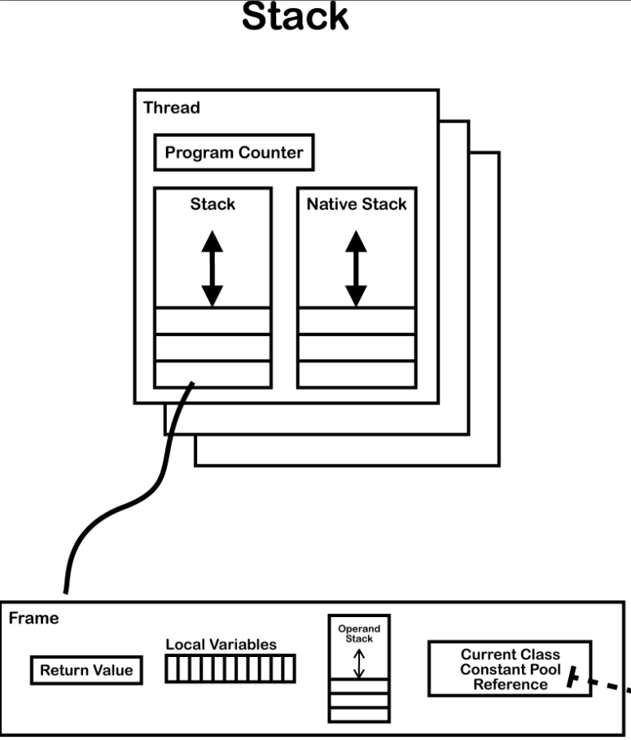
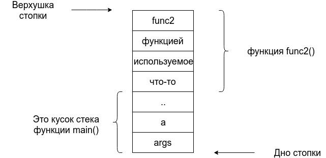
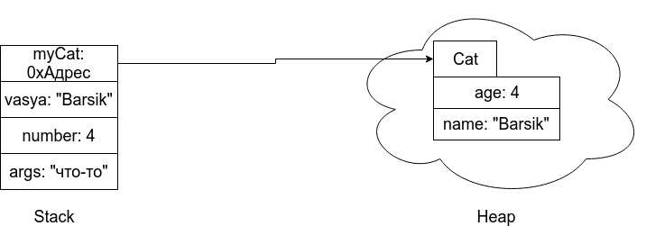
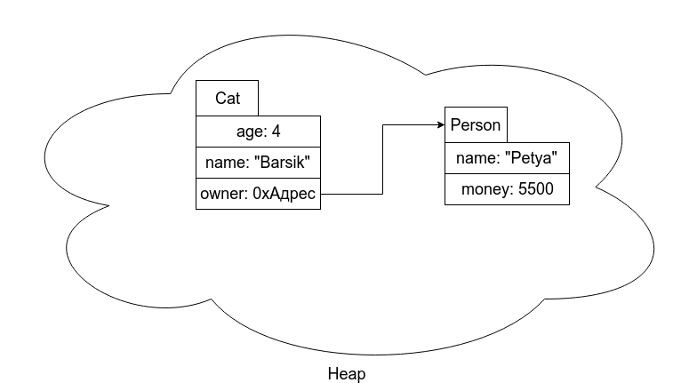

# ООП в контексте Java (редактируется)

_Весь материал, который Вы понимаете, сразу применяйте на практике.
Придумывайте идеи и старайтесь реализовывать, используя то, чему
научились на занятиях или при самостоятельном изучении._

**Письмак**

<hr/>


## Объектно-Ориентированное Программирование

### Мини-вступление

Чтобы понять "Что такое ООП?" мне понадобилось 3 недели (если не считать, что задолго до этого пытался изучить ООП в контексте C# и Python), я уже мог пользоваться этими объектами и использовать в своем Java-коде (к слову, это была усложненная версия первой лабы). 

Но, по крайней мере, я так думал. На то, чтобы **действительно** понять всю суть ООП, у меня ушло намно-оо-го больше времени, и я до сих пор думаю, что не до конца понимаю ООП. 

К чему я это? К тому, что читая какую-нибудь статью - да, вы будете знать как использовать ООП в разных языках, но не сможете ощутить всю их прелесть не покодив порядочное количество проектов. В этом я согласен с Письмаком и полностью поддерживаю его слова.

### Для "опытных" пользователей компьютера

Если вы уже знаете что такое ООП на уровне свободного использования объектов на любом языке поддерживающим парадигму ООП, то сразу можете переходить к главе **"ООП в Java"**

Далее, мы рассмотрим ООП в общем плане, не привязывая чисто к Java, но для примеров будем использовать его.

### Канон

Обычно, люди когда объясняют про всякие объекты, классы, их методы и тд, они начинают с класса. Ну, это вполне логично, потому что **объект создается из класса**.

Но я поступлю иначе, и сначала попытаюсь объяснить "что такое объект?".

Давайте попробуем связать его определение с тем, что мы уже знаем. 

#### Кузнечик

Представим себе кузнечика. Пусть, это будет наш объект. 

Какие у него есть свойства? Например, длина, окрас и пускай у него еще будет имя Боб.

Итак, попробуем записать нашего Боба:


``` 
Grig(кузнечик){
	length: 5;
	color: brown;
	name: "Bob";
}
```

Прекрасно, а что он умеет делать? Скажем, например, прыгать. Давайте запишем это как функцию:

```
Grig{
	length: 5;
	color: brown;
	name: "Bob";
	
	function jump(){ "jump 25 cm" };
	function eat(){ "eat green grass" };
}
```

Теперь, у нас есть объект - у него свойства (length, color, name) и методы (действия в данном случае)(jump, eat). Здесь важно понимать, что jump и eat - это функции, то есть выполняют какую-то операцию.

Но, насколько бы он не был интровертом, думаю, ему все равно нужна пара, поэтому давайте создадим ему девушку:

```
Grig{
	length: 4.9;
	color: green;
	name: "Alice";
	
	function jump(){ "jump 25 cm" };
	function eat(){ "eat green grass" };
}
```

Когда у нас есть два объекта, попробуем сравнить их. У них те же имена свойств (length, color, name), но разные значения. В том числе, у них одинаковые имена методов (jump, eat).

А если у них имена всех свойств и методов совпадают - давайте сделаем какой-то шаблон, чтобы из него создавать эти объекты. Пусть, это будет шаблон с именем Grig и будем создавать эти объекты по этому шаблону. При этом функции везде одинаковые, поэтому пусть это сразу будет в шаблоне. Тогда нам нужно будет указать лишь уникальные свойства.

```
class Grig {
	length: null;
	color: null;
	name: null;
	
	function jump(){ "jump 25 cm" };
	function eat(){ "eat green grass" };
}
```

Как видите, мы не можем знать какие свойства будут у объекта, поэтому просто поставим там значения `null` . Отсюда и можно понять, что **класс - это не объект**, а сущность от которого эти объекты создаются.

Мы представили объект и класс как кузнечиков. А теперь попробуйте посмотреть вокруг себя внутри комнаты, на улице. Все является объектом! И ведь правда, любой встреченный человек - это объект из шаблона ( класса) человек. Или, например, лампа - у нее есть свой цвет, размер (свойства), к тому же она может светить (метод).

Здесь я бы хотел привести цитату, которую повторял мой учитель информатики. Она, вроде как я помню, была от Брюса Ли, а оригинал я не нашел, но суть была такая:

> Видеть Кунг-Фу во всем

Казалось бы не совсем понятная цитата и я сначала посмеялся, но мой учитель объяснил, что "кунг-фу" это образное выражение того, чем ты занимаешься. Ну, на тот момент эта цитата изменилась на "видеть программирование во всем, что нас окружает".

И вот однажды после пар на Кронверкской я направлялся на Горьковскую и неожиданно меня осенило: 

-- "Так вот же объекты, вот они проходят мимо меня, эти чертовы люди! Вот стоит машина, а ведь это тоже объект".

Так, восприятие моего мира изменилась, хотя на жизнь это вряд ли повлияло. 

### ООП в Java

В этой главе рассмотрим парадигмы ООП в контексте Java, потому что без конкретных примеров объяснить будет очень трудно, но следует заметить, что **парадигмы ООП встречаются во многих языках**, но имеют свою реализацию.

**Предисловие**: если вы понимаете парадигмы ООП и умеете применять их в стеке Java, то сразу можете переходить к главе со звездочкой **Стек и Куча**.

Итак, погружаемся в ООП...

<hr/>
Прежде чем приступить к парадигмам, научимся создавать объекты и классы в Java.

Примеры исходников можно найти в `examples/manual-2`


Давайте реализуем наши классы кузнечиков в контексте Java:


*Листинг 1.1 FirstExample.java*

```java
class Grig {
    double length;
    String color;
    String name;

    void jump(){
        System.out.println(name + " is jumping");
    }

    void eat(){
        System.out.println(name + " is eating grass");
    }
}

public class FirstExample {
    public static void main(String[] args) {

        // создаем объект-кузнечик Bob
        Grig bob = new Grig();
        bob.name = "Bob";
        bob.length = 5d;
        bob.color = "brown";

        // создаем объект-кузнечик Alice
        Grig alice = new Grig();
        alice.name = "Alice";
        alice.length = 4.9d;
        alice.color = "green";

        
        bob.jump();     // output: Bob is jumping
        alice.jump();   // output: Alice is jumping
        
        bob.eat();      // output: Bob is eating grass
        alice.eat();    // output: Alice is eating grass

    }

}
```

Очень надеюсь, что мне не стоит объяснять как обращаться к свойствам (полям) или методам объекта. Так как вы, скорее всего, уже их использовали, например так:

```java
System.out.print("hello, onii-chan!")
```

Не сказал бы, что это совсем удачный пример, так как здесь затрагиваются статические поля, но не суть. Сначала вы обращаетесь к `out` и затем от него вызываете метод `print()`

По сути, `out` это **статическое** поле в классе `System` , который имеет несколько методов, в том числе и `print`  (что такое статическое разберем позже)


Вернемся к листингу и разберем все по полочкам:

1. Сначала мы **объявляем переменную** `bob`  с типом `Grig`. Замечаете определенные сходства со `String` (тут же и вопрос почему `String` нужно сравнивать через `equals`)?
2. А затем нам нужно **создать объект** из класса кузнечика и **присвоить** это **значение** к нашей переменной `bob`. Если с присвоением все понятно, то как создавать объекты из класса? По сути, также как и массивы - через оператор `new` . Его мы тоже разберем чуть позже.
3. Теперь как вы помните класс не может быть объектом, поэтому его поля не инициализированы то есть не имеют значений или же если быть корректнее - имеют значения по умолчанию. Если вы не помните или не знаете значения по умолчанию посмотрите предыдущий мануал.
   Значит, их нужно инициализировать, а сделали мы это очень тривиально и понятно.
4. Теперь можем попробовать вызвать методы класса, общаясь к ним через объекты (экземпляры)

#### Конструкторы

Согласитесь, неприятно и в общем-то неудобно задавать поля (свойства) класса вот так:

```java
Grig bob = new Grig();
bob.name = "Bob";
bob.length = 5d;
bob.color = "brown";
```

Тут на помощь к нам приходят конструкторы. Давайте сначала посмотрим его реализацию, а затем разберемся что к чему:

*Листинг 1.2 SecondExample :*

```java
public class SecondExample {
    static class Grig {
        double length;
        String color;
        String name;
        
        Grig(String grigsName, String grigsColor, double grigsLength){
            name = grigsName;
            color = grigsColor;
            length = grigsLength;
        }
        
        void jump(){ System.out.println(name + " is jumping"); }
        void eat(){ System.out.println(name + " is eating grass"); }
    }

    public static void main(String[] args) {
        // создаем объект-кузнечик Bob
        Grig bob = new Grig("Bob", "brown", 5d);
        
        // создаем объект-кузнечик Alice
        Grig alice = new Grig("Alice", "green", 4.9d);


        bob.jump();     // Bob is jumping
        alice.jump();   // Alice is jumping
        bob.eat();      // Bob is eating grass
        alice.eat();    // Alice is eating grass
    }
}
```

В основном все также, но сравните предыдущий пример инициализации полей, и вот такую:

```java
Grig bob = new Grig("Bob", "brown", 5d);
```

Здесь было бы уместно сказать  : "*Краткость - сестра таланта*"

> Не обращайте внимания на модификатор static перед объявлением класса, сейчас это к делу не относится! Вернемся к ней позже


Итак, если посмотреть изменения, то мы добавили что-то похожее на функцию, которое имеет такое же имя как у класса и к тому же не имеющий типа возвращаемого значения (даже `void` здесь не видно!):

```java
Grig(String grigsName, String grigsColor, double grigsLength){
    name = grigsName;
    color = grigsColor;
    length = grigsLength;
}
```

Но понять, что именно он делает мы можем - берем значения из аргументов нашей "псевдо-функции" и присваиваем их соответственно по значениям полей. Все просто!

Думаю, вы уже догадались откуда мы будем получать эти аргументы - при вызове `new Grig()`

Так, `Grig()` - это метод или нет? Попробуйте использовать `Grig()` как обычный метод :)

У вас будет ошибка компиляции, потому что, `Grig()` - это действительно метод (это можно сказать по его схожести объявления в классе), но как вы могли заметить - **он особенный** .

Если коротко, то:

> Конструктор - это специальный метод, который вызывается при создании нового объекта


Подождите! Мы же их вызывали раньше, а там ведь не было никаких методов!

```java
Grig bob = new Grig();
```

Да, если попробовать запустить его, добавив конструктор такого вида (который ничего не делает):

```
Grig(){
    
}
```

Код все равно будет рабочим, а это значит, что если созданный вами класс не имеет конструктора, **компилятор автоматически добавит конструктор по умолчанию**.

Это можно увидеть в байт-коде через команду `javap` (пример из предыдущего мануала):

```java
public class Hello {
        public static void main(String ... args){
                for(int i=0;i<10;i++){
                        System.out.println("ITMO");
                }
        }
}
```

Компилим и смотрим его байт-код:

```
Compiled from "Hello.java"
public class Hello {
  public Hello();		// <--- вот эта вот!
    Code:
       0: aload_0
       1: invokespecial #1    // Method java/lang/Object."<init>":()V
       4: return

  public static void main(java.lang.String...);
    Code:
       0: iconst_0
       1: istore_1
       2: iload_1
       3: bipush        10
       5: if_icmpge     22
       8: getstatic     #2    // Field java/lang/System.out:Ljava/io/PrintStream;
      11: ldc           #3    // String ITMO
      13: invokevirtual #4    // Method java/io/PrintStream.println:(Ljava/lang/String;)V
      16: iinc          1, 1
      19: goto          2
      22: return
}
```

Мы не объявляли никакого конструктора, но в скомпилированной версии он есть. Его также именуют "***конструктором по умолчанию***" или в документации Java "*no-arg constructor*"

Следует заметить, что создание хотя бы одного конструктора уже отменяет автоматическое добавление конструктора по умолчанию.

Идем дальше, так в чем же заключается **особенность конструктора**?


Во-первых, **имя конструктора должно совпадать с именем класса**. Причиной этому стали две тонкости:

1. Любое имя, которое вы используете, может быть задействовано при определении членов класса, так возникает *конфликт имен*. 
2. *За вызов конструктора отвечает компилятор*, поэтому он всегда должен знать, какой именно метод следует вызвать.

Во-вторых, **у конструктора отсутствует возвращаемое значение**. Конструкторы никогда и ничего не возвращают (оператор `new` возвращает ссылку на вновь созданный объект, но сами конструкторы не имеют выходного значения). 

К слову, **в классе может быть несколько конструкторов**, но они как и методы, должны иметь разную сигнатуру (входные аргументы).

Также обязательно посмотрите главу **Блоки инициализации**


## Стек и куча

В этой главе речь пойдет о хранении данных в Java, в том числе про стек(stack) и кучу(heap). И перед тем как приступить к этой главе, я бы настоятельно рекомендовал получше изучить объекты и их работу с ними. Попробуйте, например, воссоздать объекты из реального мира.

Самое главное, вам нужно понять как работать с ними.

Далее, идет глава не самая легкая для понимания. Если вы впервые сталкиваетесь с ООП, то тем более. Но это не говорит о том, что эту главу можно пропустить. Почитайте. Таким образом, вы восполните свой словарный запас и хотя бы на каком-то (очень абстрагированном ) уровне поймете принцип работы ООП в Java.

Когда-то, я начал читать книгу Джоша Лонга "*Java EE для предприятий*" . Там рассказывалось про архитектуру приложений в Java EE, но не суть. Дело в том, что мой уровень не позволял понять полностью, о чем в этой книге говорится, но я все равно читал.

И когда я одновременно с этим листал презентацию из se ifmo или из других источников, то сразу вспоминал слова находящиеся там и мог примерно понять, о чем идет речь.

К слову, эту книгу я перечитывал трижды и каждый раз одни и те же главы открывали для меня что-то новое, что я не мог увидеть раньше.

### Ссылочные типы

Виртуальная машина Java содержит явную поддержку объектов. Объектом мы называем динамически создаваемый экземпляр класса или массив. Ссылка на объект представлена в виртуальной машине Java типом `reference`. Значения типа `reference` могут быть рассмотрены как указатели на объекты. На один и тот же объект может существовать множество ссылок. Передача объектов, операции над объектами, проверка объектов происходит всегда посредством типа `reference`.

Так, `bob` и `alice` (наши переменные) являются ссылками на объекты.

Существуют три разновидности ссылочных (`reference`) типов: **тип класса, тип массива и тип интерфейса**. Значения этих типов представляют собой ссылки на экземпляр класса, ссылки на массив и ссылки на имплементацию интерфейса соответственно (про интерфейсы еще далеко).

Тип массива представляет собой *составной тип* единичной размерности (длина которого не определена типом). Каждый элемент составного типа сам по себе может также быть массивом. Последовательно рассматривая иерархию составных типов в глубину, (тип, из которого состоит составной тип, из которого состоит составной тип и т.д.) мы придём к типу, который не является массивом; он называется *элементарным типом* типа массив. Элементарный тип всегда либо примитивный тип, либо тип класса, либо тип интерфейса.

Тип `reference` может принимать специальное нулевое значение, так называемая ссылка на не существующий объект, которое обозначается как `null`. Значение `null` изначально не принадлежит ни к одному из ссылочных типов и может быть преобразовано к любому.

### Области данных в рантайме

#### Регистр PC

Виртуальная машина Java может поддерживать множество потоков, выполняющихся одновременно. Каждый поток виртуальной машины Java имеет свой регистр **pc** (*program counter*). В каждый момент времени каждый поток виртуальной машины исполняет код только одного метода, который называется текущим методом для данного потока. Если метод платформенно независимый (т.е. в объявлении метода не использовано ключевое слово `native`) регистр pc содержит адрес выполняющейся в данный момент инструкции виртуальной машины Java. Если метод платформенно зависимый (`native` метод) значение регистра **pc** не определено. 

#### Стек виртуальной машины Java

Каждый поток виртуальной машины имеет свой собственный *стек виртуальной машины Java*, создаваемый одновременно с потоком. Стек виртуальной машины хранит **фреймы**. 

Стек виртуальной машины Java аналогичен стеку в традиционных языках программирования: он хранит локальные переменные и промежуточные результаты и играет свою роль при вызове методов и при возврате управления из методов. Поскольку работать напрямую со стеком виртуальной машины Java запрещено (кроме операций `push` и `pop` для фреймов), фреймы могут быть также расположены в куче. Участок памяти для стека виртуальной машины Java не обязательно должен быть непрерывным.

В следующих случаях виртуальная машина Java формирует исключение при работе со стеком:

- Если вычисления в потоке требуют памяти более чем позволено размером стека, виртуальная машина Java формирует исключение `StackOverflowError`.
- Если стек виртуальной машины Java допускает динамическое увеличение размера и попытка такого увеличения была выполнена, однако вследствие нехватки памяти не завершена успешно либо не достаточно памяти при инициализации стека при создании потока, то виртуальная машина Java формирует исключение `OutOfMemoryError`.

Не будем подробно разбирать исключения, а это совсем отдельная тема, но если вы встретите их, то уже будете знать в чем дело (хотя и не факт, что сможете пофиксить)

#### Куча

Виртуальная машина Java содержит область памяти, называемую *кучей*, которая находится в пользовании всех потоков виртуальной машины. Куча – это область памяти времени выполнения, содержащая массивы и экземпляры всех классов.

Куча создаётся при запуске виртуальной машины Java. Удаление неиспользуемых объектов в куче производится системой автоматического управления памятью (известной как *сборщик мусора* (к этой теме мы еще вернемся)) 

Объекты никогда не удаляются явно. Виртуальная машина Java не предполагает какого-либо одного алгоритма для системы автоматического управления памятью; алгоритм может быть произвольно задан разработчиком виртуальной машины в зависимости от системных требований. Куча может быть фиксированного размера, либо динамически расширяться и сужаться при удалении объектов. 

Участок памяти для кучи виртуальной машины Java не обязательно должен быть непрерывным.


### Что и где хранится?

Мы рассмотрели два хранилища данных программы - стек и куча. Почему же их две и чем они отличаются?

Сначала, рассмотрим что такое стек и как она работает.

Во-первых, под стеком подразумевается  некоторый принцип хранения данных и обращения к данным. Обычно здесь можно привести в пример стопку тарелок. Мы можем положить тарелку сверху и взять тоже только сверху. Такой принцип называется LIFO (Last-In-First-Out).

Согласитесь, довольно странный способ хранения информации, правда?

Давайте разберемся как он может пригодиться в нашей программе.


> Далее, будет много байт-кода и углубление в JVM, но как по мне - это не так сложно понять, хотя и будут трудности. И эту главу необязательно читать, если вы желаете сдать только лабу, но если вы хотите больше узнать как работает ваша любимая JVM - добро пожаловать!
>
> И также, обязательно к прочтению глава `this`  - это просто необходимо знать.

#### Зачем нужен стек в Java?

Давайте внесем немножко Java в свою жизнь:

*Листинг 2.1 DataExample.java*

```java
public class App {
 public static void main(String[] args) {
     System.out.print("Enter a:");
     int a = Integer.parseInt(System.console().readLine());
     System.out.print("Enter b:");
     int b = Integer.parseInt(System.console().readLine());
     System.out.println("a+b=" + pow(a,b));
 }
 public static Long pow(int base, int exponent) {
     Long result = 1L;
     for (int i = 0; i < exponent; i++) {
          result *= base;
     }
     return result;
 }
}
```

Давайте сначала рассмотрим только метод main.

Какие у нас данные? Во-первых, это наши переменные `a`,`b`. Также, у нас входные данные `args`. Итого, мы насчитали 3, давайте это проверим, запустив команду:

```
javap -v -c DataExample
```

Пропускаем оттуда пул констант и переходим сразу к этому:

```
  public DataExample();
    descriptor: ()V
    flags: ACC_PUBLIC
    Code:
      stack=1, locals=1, args_size=1
         0: aload_0
         1: invokespecial #1                  // Method java/lang/Object."<init>":()V
         4: return
      LineNumberTable:
        line 4: 0

  public static void main(java.lang.String[]);
    descriptor: ([Ljava/lang/String;)V
    flags: ACC_PUBLIC, ACC_STATIC
    Code:
      stack=4, locals=3, args_size=1	// <----------- [ ЗДЕСЬ ] !!!
         0: getstatic     #2         
         3: ldc           #3         // String Enter a:
         5: invokevirtual #4                  
         8: invokestatic  #5                  
        11: invokevirtual #6                  
        14: invokestatic  #7                  
        17: istore_1
        18: getstatic     #2                  
        21: ldc           #8         // String Enter b:
        23: invokevirtual #4                  
        26: invokestatic  #5                  
        29: invokevirtual #6                  
        32: invokestatic  #7                  
        35: istore_2
        36: getstatic     #2                  
        39: new           #9          // class java/lang/StringBuilder
        42: dup
        43: invokespecial #10                 
        46: ldc           #11         // String a+b=
        48: invokevirtual #12                 
        51: iload_1
        52: iload_2
        53: invokestatic  #13         // Method pow:(II)Ljava/lang/Long;
        56: invokevirtual #14                 
        59: invokevirtual #15                 
        62: invokevirtual #16                 
        65: return
	
	 public static java.lang.Long pow(int, int);
	 // к методу pow мы вернемся позже
}
SourceFile: "DataExample.java"
```


Давайте обратим внимание на строку : `stack=4, locals=3, args_size=1`. Как видно из неё, мы оказались правы - 3 локальные переменные, в том числе одна из них это входные данные

Разберем значения этих трех свойств:

* `stack` - максимальный размер стека, необходимый для выполнения процедуры
* `locals` - локальные переменные
* `args_size` - входные данные. Есть парочка интересных моментов с ней, поэтому мы еще вернемся к этому параметру.

Теперь посмотрим на метод `pow` :

```

  public static java.lang.Long pow(int, int);
    descriptor: (II)Ljava/lang/Long;
    flags: ACC_PUBLIC, ACC_STATIC
    Code:
      stack=4, locals=4, args_size=2
         0: lconst_1			
         1: invokestatic  #14   
         4: astore_2
         5: iconst_0
         6: istore_3
         7: iload_3
         8: iload_1
         9: if_icmpge     29
        12: aload_2
        13: invokevirtual #15  
        16: iload_0
        17: i2l
        18: lmul
        19: invokestatic  #14    
        22: astore_2
        23: iinc          3, 1
        26: goto          7
        29: aload_2
        30: areturn
      LineNumberTable:
        line 10: 0
        line 11: 5
        line 12: 12
        line 11: 23
        line 14: 29
      StackMapTable: number_of_entries = 2
        frame_type = 253 /* append */
          offset_delta = 7
          locals = [ class java/lang/Long, int ]
        frame_type = 250 /* chop */
          offset_delta = 21
```


Здесь для выполнения операций нужно четыре слота стека 

Также, мы имеем два аргумента и еще две локальные переменные - `result` и `i` 


**Задачка для тех, кто умеет работать с ООП**

```java
public class Test {
   public void plus(){
		int a = 1;
		int b = 3;
   }
 }
// stack=1, locals=3, args_size=1

```

Разберите в этом примере, почему в стеке операндов нам нужен лишь один слот и почему у нас три локальных переменных. (*Подсказка*: args_size тоже входит в их число)


Смотрите сюда, если вы не смогли узнать сами почему там `args_size = 1` или сделали какое-нибудь предположение, следующая подсказка:

```java
public class Test {
   public static void plus(){
	int a = 1;
	int b = 3;
   }
 }
// stack=1, locals=2, args_size=0

```


**Ответ**

Во-первых, у нас есть две переменные `a`, `b`  - уже две локальные переменные, а где же третья?

Третья переменная - это `this` (ссылка на экземпляр класса, если вы не знаете, что это, то разберем дальше). Вам могла помочь последняя подсказка, когда мы объявили метод `plus` статической.

Теперь, почему же в стеке нам нужен лишь один слот? - потому что нам нужно только сохранить 1 и присвоить переменной, затем нам эта единица с стеке уже не нужна, поэтому мы можем заменить её уже тройкой, а еще один слот нам уже не нужен.

#### Таинственный this и static

Что же это за `this` , который передается нестатическим методам.

`this` - это ссылка на экземпляр класса. Иначе, если мы создаем объект из нашего класса, то мы можем ссылаться на его экземпляр через переменную `this` , поэтому в байт-коде, как вы могли видеть, присутствует `args_size=1`.

Зачем нам это нужно?

Во-первых, мы можем ссылаться на поля своего же объекта. Да, можно использовать только имя поля - это разрешено, но иногда бывают ситуации, когда имя аргумента функции совпадает с полем класса. Возникает конфликт имен - ошибки компиляции, конечно, не будет, но вы не сможете обратиться к полю класса.

Например, первый наш пример можно заменить таким образом:

```java
public class SecondExample {
    static class Grig {
        double length;
        String color;
        String name;
        
        Grig(String name, String color, double length){
            this.name   = name;
            this.color  = color;
            this.length = length;
        }
        
        // some methods
    }

    public static void main(String[] args) {
        // something actions
    }
}
```


Такой код читается лучше и понятнее. 

Разумеется, это не единственное предназначение ссылки `this`

Второе и очень важное его предназначение, а точнее способ его использования - это возможность передавать ссылку на экземпляр. Звучит непонятно...

Допустим, у вас есть метод который принимает пользовательский тип:

```java
public void func(MyClass clazz){ /* something actions */};
```

Использовать её не составляет труда:

```java
MyClass ex = new MyClass();
func(ex);
```

Но вдруг мы хотим использовать её внутри реализации нашего класса.

То есть, у нас есть некоторый метод в MyClass, который должен вызывать функцию `func` , передавая экземпляр самого себя. Без `this` это практически было бы нереализуемо, по крайней мере, очень сложно.

А здесь мы можем использовать:

```java
public MyClass{
    public void myMethod(){
        func(this);
    }
}
```


Возвращаясь к хранениям данных, то мы уже знаем, что этому методу неявно передается ссылка на `this`  (см. главу "Зачем нужен стек")


Теперь о статических методах - это методы, которые прикреплены не к экземпляру класса, а к самому классу. То есть они не требуют экземпляра, чтобы выполниться и при этом, им не передается ссылка на `this` . Опять же мы могли видеть это в предыдущей главе.

Их преимущество в том, что они не требуют экземпляра класса, поэтому мы можем использовать такой код:

```java
class MyClass {
    public static void func(int a){ /*something action...*/};
}

// еще где-то в исходниках:
MyClass.func(12);
```


Как видите, мы не создавали экземпляр класса MyClass, а сразу обратились  к методу.

Статические поля или методы объявляется с ключевым словом `static`

Обоюдоострым мечом статических методов является то, что статические данные одни и те же для всех экземпляров. То есть, если у нас есть два экземпляра класса и каждый их них увеличит статическое поле класса на единицу, то в итоге мы получим +2, так как данные едины для всех экземпляров класса. Это очень логично так как статические методы и поля принадлежат классу, а не экземпляру класса.

Давайте рассмотрим пример:

*Листинг 3.1 StaticExample*

```java
public class StaticExample {
	static class MyClassNonStatic {
		int a = 0;
		void inc(){
			a++;
		}
	}

	static class MyClassWithStatic {
		static int a = 0;
		void inc(){
			a++;
		}
	}

	public static void main(String ... args) {
		MyClassNonStatic a = new MyClassNonStatic();
		MyClassNonStatic b = new MyClassNonStatic();
		a.inc();
		b.inc();
		
		System.out.println(a.a + " " + b.a);	// 1 1
		
		a.inc();	

		System.out.println(a.a + " " + b.a);	// 2 1	

		MyClassWithStatic c = new MyClassWithStatic();
		MyClassWithStatic d = new MyClassWithStatic();
		
		c.inc();
		d.inc();
		System.out.println(c.a + " " + d.a);	// 2 2

		c.inc();
		System.out.println(c.a + " " + d.a);	// 3 3
	}
}

```


Здесь мы создаем два класса: `MyClassNonStatic` - без статического поля, `MyClassWithStatic` - со статическим полем.

Из примера все видно - наглядно и просто.


Минусом статических методов, является то, что они не могут использовать нестатические поля класса, так как они не имеют ссылки на `this` (экземпляр класса).

> Практика: попробуйте в классе MyClassNonStatic объявить метод func статическим и обратится к полю "а"


#### Преимущество стека и области видимости

У многих мог возникнуть вопрос, а почему мы используем стек?

Для этого рассмотрим еще один термин **области видимости.** 


У каждой переменной есть область видимости - область, внутри которой можно обращаться к переменной.

Простой пример,

```java
public class MyClass {
    static void func(){
		int a = 2;
    }
    public static void main(String ... args){
		func();
		System.out.println(a);	// error: cannot find symbol
    }
}
```

Здесь мы пытаемся обратится к переменной `a` из другого метода, но получаем ошибку, так как область видимости переменной `a` ограничена блоком кода функции `func`, иными словами, переменная объявленная внутри функции `func` может использоваться только внутри неё самой.

Мы увидели пример того как область переменной ограничивается блоком кода (телом функции). 

Теперь посмотрим пример того, как область видимости может содержать другие области видимости:

```java
public class MyClass {
    
	static int a = 5;
    
    public static void main(String ... args){
        System.out.println(a);	// 5
    }
}
```

Область видимости main содержится внутри области видимости тела класса, поэтому мы можем использовать переменную `a`. 

Выходит что мы не можем объявить переменную с именем `a`? Нет, мы можем её объявить, и тогда мы будет обращаться уже к ней - тут все дело в том, как JVM ищет нужную переменную.

Сначала мы ищем эту переменную в своей области видимости, где она объявлена, если мы не находим там, то ищем в той области, где находится наша область и т.д. Если мы ничего не найдем, то компилятор выведет ошибку `cannot find symbol`.


**Как это все организовано?**


Принцип работы со стеком очень удобно применять для управления временем жизни и видимости переменных.

Механизм такой: когда программа начинает исполнять какую-то функцию, то под используемые в ней переменные выделяется место в стеке (это не то, что указано в байт-коде в свойстве `stack`, напомню, что тот стек - это стек операндов). Для наглядности посмотрим схему:





Да-да, в потоке программы есть несколько стеков, но углубляться мы не будем, так как лишь хотим узнать как хранятся данные нашей программы.

Итак, что такое стек операндов, который мы ранее разбирали? Он используется при выполнении инструкций байт-кода. 

Например, когда мы хотим объявить переменную

```java
int i;
```

То получаем такую инструкцию, которая взаимодействует со стеком операндов и локальными переменными:

```java
	// Положить 0 наверху стека операнодов:
	0:	iconst_0
	
	// вытолкнуть верхнее значение из стека операндов 
	// и сохранить как локальную переменную 1
	1:	istore_1	
```

После этой операции в стеке операндов не остается значений - все лишнее и не используемое в конкретный момент - убирается из стека операндов.

Поэтому в этом коде понадобится лишь один слот стека операндов:

```java
public class Test {
   public static void plus(){
	int a = 1;
	int b = 3;
   }
 }
// stack=1, locals=2, args_size=0
```

Возвращаемся  к листингу 2.1:

*Листинг 2.1 DataExample.java*

```java
public class DataExample {
 public static void main(String[] args) {
     System.out.print("Enter a:");
     int a = Integer.parseInt(System.console().readLine());
     System.out.print("Enter b:");
     int b = Integer.parseInt(System.console().readLine());
     System.out.println("a+b=" + pow(a,b));
 }
 public static Long pow(int base, int exponent) {
     Long result = 1L;
     for (int i = 0; i < exponent; i++) {
          result *= base;
     }
     return result;
 }
}
```


Упростим себе представление стека (не стек операндов) и посмотрим что там происходит:

 

При старте нашей программы в стеке будет выделено место под переменные `args`, `a`, `b`. По мере выполнения этой функции, ячейки в стеке будут заполняться какими-то значениями. В тот момент, когда программа дойдет до вызова функции `pow` в стеке создастся место под переменные необходимые для этой функции.

На рисунке мы можем разделить стек на несколько участков - это и есть *фреймы* (или иногда их называют кадрами). Заметим, что **это упрощенное представление стека**, на самом деле, там гораздо больше значений.

Здесь важно еще то, что аргументы функции (`base`, `exponent`) являются отдельными местами в памяти. Может показаться, что раз в нашей программе мы передаем в функцию `pow`   `a` и `b`, то внутри неё мы будем общаться с этими местами в стеке. 

Это мнение ошибочно. **Код вызываемой функции `pow` не может менять переменные внешней функции `main`**, поэтому когда при исполнении программа доходит до строки с вызовом функции `pow(a, b)`, значения, которые хранятся в соответствующих местах **копируются в места выделенные под `base` и `exponent`.**  В момент, когда внутренняя функция заканчивает свою работу, то место в стеке используемое под неё очищается и может быть использовано дальше. Например, для вызова следующей функции.


Давайте подробнее остановимся на моменте с очищением места в стеке.

Простой код:

```java
public class App {
   public static void main(String[] args){
       int a = 3;
       int b = 4;
       int c = func1(a, b);    
       c++;
       d = func2(c, a);
   }
    // something methods
}
```


Допустим, что программа сейчас исполняет `func1` внутри метода `main` .

Стек будет выглядеть следующим образом:


Очень важно, понимать, что в этот момент времени в стеке нет ничего, что имеет отношение к функции `func2`.

В тот момент, когда мы войдем в `func2` часть стека используемая под `func1` будет стёрта, а на её месте будет `func2`




Итак, стеке хранятся данные, относящиеся к контексту функций, которые на этот момент времени выполняются. К таким данным относятся локальные переменные функции (то, что объявлено в её теле), аргументы функции,  адрес возврата и возможно возвращаемое значение.


Наконец-то мы закончили со стеком, а теперь осталась куча. Что же это такое и как она работает?

#### Ссылочные типы данных и зачем нужна куча в Java?

Ранее в аргументах функции мы использовали простые типы данных, а что если нам необходимо использовать некоторые структуры? 

Например, мы определили, что есть структура `человек` и она состоит из строки, описывающей имя человека и числа, описывающего его возраст. Получается, что когда нам нужно передать в функцию информацию о каком-то конкретном человеке (одна переменная), то нам нужно скопировать уже 2 значения. Вообще это похоже на то, как в примере выше копировались значения переменных a и b в аргументы функции. 

Но иногда возникает такая ситуация, когда необходимо копировать достаточно много данных и если делать это достаточно часто, то будет много накладных расходов как по времени, так и по используемой памяти на хранение множества копий.

А что если функции передавать не само значение, а адрес, где оно лежит? К сожалению или к счастью, стек не предоставляет операции, где мы можем получить доступ к определенному месту в нем. К тому же, мы позволим какой-то функции `func1` влезть в данные функции `func2` , что не есть хорошо.

Также, если мы будем хранить нашу структуру в стеке, и создать экземпляр нашей структуры (класса) во внутренней функции, то передать ссылка на это место наверх к праотцам будет невозможно, так как в момент выхода, данные этой функции будут уничтожены (*см. главу Преимущество стека и области видимости*)

Таким образом, использование стека  не предвещает ничего хорошего.


Тогда нам нужно еще одно хранилище данных, не имеющее вышеописанных минусов.

Для решения этих проблем было предложено сделать отдельную область памяти и назвать её **кучей (heap)**. Куча будет хранить какие-то долгоживущие объекты. Например нашу информацию о людях или о котиках.

Теперь давайте представим, что у нас есть такой код на Java:

```java
class Cat {
   String name;
   int age;
}
 
class App {
   public static void main(String[] args) {
      int number = 4;
      String vasya = "Барсик"; // Внешность обманчива :)
      Cat myCat = new Cat(vasya, number);
   }
}
```

В этом коде мы объявили некоторый класс (структуру), которая описывает кота и содержит информацию о его возрасте и имени. В функции `main` мы создали несколько переменных, в том числе создали нового кота.

Исходя из всего вышеописанного, не трудно догадаться, что созданный нами объект `Cat` будет хранится в куче по какому-то адресу памяти. Собственно, этот адрес будет хранится как переменная `myCat`, иными словами `myCat` только указывает на место хранения объекта и не хранит его значения.

Выглядит это так:




Как видно на картинке, **стек хранит адрес объекта, который лежит в куче**. Теперь если нам нужно будет передать нашего кота в какую-то другую функцию, то мы просто скопируем его адрес в стек другой функции. Получается, что какие-то переменные хранят адрес, а какие-то само значение. По этой причине в Java типы данных переменных разделяют на два типа. **Ссылочные** типы данных и **примитивные**. Примитивные типы хранят само значение, а ссылочные - адрес на место в кучи, где лежит объект.


К слову, была популярная задачка про сравнение String. Я её слегка изменил,  но суть не изменилась:

```java
public class Task {
  public static void main(String ... args){
      String s1 = "123";
      func(s1);
  }

  static void func(String s1){
    String s2 = "123";
    System.out.println(s1 == s2);			// false
    System.out.println(s1 + " == " + s2);	// 123 == 123
    
  }
}
```


Раньше я уже упоминал про `String` - это не примитивный тип данных. 

Стринги в Java это отдельная тема разговоров, где используются различные паттерны для их оптимизации (такие как String pool). Про них можно почитать в [javarush](https://javarush.ru/groups/posts/equals-java-sravnenie-strok).


Вернемся к куче.

Давайте представим, что у нашего кота появилась дополнительная информация о его владельце (отдельное поле в классе `Cat`), которая представлена информацией об имени и количестве денег у него:




Этот пример даёт понять важную вещь - адрес на объект не всегда хранится в стеке. В нашем примере владелец - часть информации о коте и если кот хранится в куче, то и ссылка на его владельца хранится там же. Но при этом так как `Person` - ссылочный тип данных, то он тоже хранится в куче, а у кота есть ссылка на него. 

Ошибочно считать, что все данные о человеке будут находиться в том же кусочке где и данные кота. Также неверно считать, что если у нас переменная имеет примитивный тип данных, то она лежит в стеке. Возраст является частью кота, поэтому он находится там же где и информация о коте. Но при этом  там лежит само значение 4, а не какой-то адрес, который указывает на место где записано 4.

#### Ластхит по стеку и куче

Из всего сказанного ранее следует, что в стеке хранится контекст исполняемых функций, а именно их локальные переменные, переданные в них аргументы, а также адрес возврата и возвращаемое значение. В зависимости от того какой тип имеют эти переменные (`ссылочный` или `примитивный`) в стеке могут лежать либо сами значения, либо адрес на место в куче. В куче же хранятся все объекты (которые являются ссылочными типами данных). Если объект содержит примитив, то внутри блока памяти отведенного под этот объект хранится само значение (в нашем примере 4), если же объект содержит ссылочный тип данных, то внутри него хранится адрес на другое место в куче, которое содержит информацию об этом объекте.


## Парадигмы ООП

Давайте оставим байт-коды и прочее углубление в JVM и поднимемся на уровень выше - уровень абстракций.

В этой главе рассмотрим три основные парадигмы (абстракцию смотрите сами).

### Инкапсуляция

Определение из википедии:

> Инкапсуляция — в информатике упаковка данных и функций в единый компонент.

Вроде бы верно, но это что-то слишком общее, что нельзя считать нормальным ответом.

Посмотрим, что пишут в методичке кафедры ВТ:

> Инкапсуляция - сокрытие данных внутри объекта и обеспечение доступа к ним с помощью общедоступных методов.

Это уже похоже на более внятный ответ. Разберем его получше.


Во-первых, следовало бы оговориться, что такие парадигмы ООП как инкапсуляция и полиморфизм - не относятся только к ООП, это лишь её парадигмы. Но здесь мы будем разбирать именно в контексте ООП.

Зачем нам нужно скрывать данные объекта?

Мы не должны давать другой системе (внешней) напрямую изменять свойства класса. Если мы дадим любой системе изменять наши данные внутри объекта, то мы не сможем это корректно контролировать, что может привести к ошибке.

Поэтому мы должны предоставлять метод, который позволит изменить значение нашей переменной, если надо.

Приведу, очень простой пример, где инкапсуляция может помочь:

```java
class MyClass{
	String val = "default";

	void printValLength(){
		System.out.println(val.length());
	}

}
public class Main {
	public static void main(String[] args) {
		MyClass a = new MyClass();
		a.printValLength();   // 7

		a.val = null;         // произвольно меняем значение
		a.printValLength();   // java.lang.NullPointerException
	}
}
```

Здесь, как вы видите, мы создаем класс с полем `val`, значение которой любая внешняя система может изменить. Как мы видим, в методе `printValLength` мы вызываем метод `legnth` , чтобы узнать длину строки. Но мы не можем знать, что значение `val` не равен `null` и поэтому, когда мы выполняем эту функцию, то есть шанс получить `NPE()NullPointerException` .

```java
class MyClass{
	private String val = "default";

	void printValLength(){
		System.out.println(val.length());
	}

	public void setVal(String val){
        if (val == null) this.val = "";
        else this.val = val;
	}

}
public class Main {
	public static void main(String[] args) {
        MyClass a = new MyClass();
        a.printValLength();   // 7

        a.setVal(null);      
        a.printValLength();   // 0
  }
}
```

 

Здесь мы добавили проверку на `null` и можем гарантировать, что `val` не будет равен `null`.

Как же мы этого добились? 

Во-первых,  использовали модификатор доступа `private` тем самым ограничив область видимости нашего поля, тем самым не давая обращаться к этому полю за пределами тела класса.

Модификаторов доступа всего лишь четыре:

* `private` - который дает возможность обращаться лишь коду из его класса, где он объявлен. В нашем случае, мы можем обращаться к полю `val` только внутри `MyClass`.
* `public` - поля и методы, объявленные с модификатором public, видны другим классам из текущего пакета и из внешних пакетов (к ним еще вернемся).
* `protected` - область видимости ограничена текущим пакетом и классами-наследниками (об этом еще поговорим)
* `по-умолчанию` - если не объявлять модификатор доступа, то он будет дефолтным - область видимости ограничена всеми классами внутри пакета (поэтому иногда его также называют `package-visible`) 


Во-вторых, мы создали сеттер - `setVal`. По конвенции Java, следует называть сеттеры так:

`set<ИМЯ-ПОЛЯ>`, как сделали мы. Таким образом, другим программистам использующим ваш код или библиотеку, станет легче ориентироваться и он сразу будет знать как называется переменная, значение которой он изменяет. 

По сути, мы сделали метод, который изменяет внутреннее состояние объекта. Здесь важно  то, что объект сам изменяет своё состояние (совокупность свойств). То есть, изменяя переменную через такую функцию (сеттер), мы можем быть уверены, что никакой ошибки не будет (как например, NPE).

Разумеется, это не всегда так, бывают и ошибка, так как все мы люди, но всегда старайтесь делать так, чтобы изменение переменных через сеттер гарантировало безопасность.


К слову, есть обратное действие сеттеру - геттер, когда мы хотим не изменить значение поля, а получить его значение. Ведь, мы все равно не можем обратится к`private` переменной. Поэтому необходимо будет создать и метод, который возвращает значение поля:

```java
class MyClass{
	private String val = "default";

	void printValLength(){
		System.out.println(val.length());
	}

	public void setVal(String val){
		if (val == null) this.val = "";
		else this.val = val;
	}

	public String getVal(){
		return this.val;
	}

}
public class Main {
	public static void main(String[] args) {
      
        MyClass a = new MyClass();
        a.printValLength();   // 7
        System.out.println(a.getVal()); // default

        a.setVal(null);;      
        a.printValLength();   // 0
  }
}
```

> Задание: посмотрите "Листинг 1.2 SecondExample" в главе конструкторы. Создайте там геттеры\сеттеры и объявите все поля `Grig`  `private`


### Наследование

Википедия:

> **Наследование**  — концепция объектно-ориентированного программирования, согласно которой абстрактный тип данных может наследовать данные и функциональность некоторого существующего типа, способствуя повторному использованию компонентов программного обеспечения

Тут следует заметить, что под абстрактным типом подразумевается класс.


А вот более приближенное к Java определение кафедры ВТ:

> Наследование или расширение - приобретение одним классом (подклассом) свойств другого класса (суперкласса)


На самом деле, преимущества использования наследования очень полезны с использованием полиморфизма, но этому мы вернемся позже, а сейчас попробуем разобрать функционал, который дает нам наследование без учета полиморфизма.


Во-первых, это возможность наследования методов и даже полей. Допустим, у вас есть достаточно большой класс, содержащий, скажем, 12 методов. И вы должны создать класс, который имеет те же 12 методов, но и еще две дополнительные.

Первый вариант - это переписать весь тот большой класс в свой и добавить туда эти два метода. Казалось бы, почему бы и нет. Так, вы создали еще 5 классов, немного отличающихся друг от друга дополнительными методами. Но вдруг в один прекрасный день обнаружился баг в одном из методов, который присутствует в каждом из 7 классов, которые вы создавали. Вам сильно повезло, если вы записали в блокнот какие классы имеют вот этот одинаковый по реализации метод.

Второй вариант - это использование наследования. К счастью, наследование дает нам возможность избежать проблем первого варианта. Нам нужно просто наследоваться от нужного класса (который имеет 12 методов) и в своем классе определить лишь те методы, которых нет в суперклассе (класс от которого мы наследуемся).

Рассмотрим простой пример реализации наследования. Пример `inheritance/example1/InheritanceExample.java`

Определим наш класс человека

```java
class Person {
	private String name;
	private int age;

	public void doSomething(){
		System.out.println("I'm individual person");
	}

	// геттеры / сеттеры
}
```

И давайте создадим босса:

```java
class Boss extends Person {
	public void doSomethingLikeABoss(){
		System.out.println("I'm a boss!");
	}
}
```


Попробуем сделать какие-нибудь манипуляции:

```java
Person person = new Person();

person.doSomething();		// I'm individual person
person.setAge(18);
person.setName("Lilith");

System.out.println(person.getName() + " " + person.getAge()); // Lilith 18

Boss boss = new Boss();

boss.setAge(30);		// методы наследованные от суперкласса (Person)
boss.setName("Boris");
System.out.println(boss.getName() + " " + boss.getAge());	// Boris 30

boss.doSomething();				// I'm individual person
boss.doSomethingLikeABoss();	// I'm boss!
```


Если посмотреть на класс `Boss`, то мы можем видеть только один метод, но по факту можем использовать все доступные методы из `Person`.

Что значит доступные? Так или иначе, модификаторы доступа к методам или полям при наследовании также остаются. При этом `private` методы или поля мы не сможем использовать даже в классе потомке (в нашем случае `Boss`).

> Задание: Попробуйте объявить поле age `protected` и обратится к ней напрямую из потомка.

И есть две очень важные вещи, касаемо наследования. Их мы и разберем.

Давайте, добавим конструктор в класс `Person` , потому что задавать их вручную - неудобно.

Пример `inheritance/example2/InheritanceExample2.java`

```java
class Person {
	private String name;
	private int age;

	public Person(String name, int age){
		this.name = name;
		this.age = age;
	}

	public void doSomething(){
		System.out.println("I'm individual person");
	}

	// геттеры и сеттеры
}
```

Как только мы объявили конструктор в родительском классе, то должны объявить его и в классе потомке, если нету конструктора по умолчанию.

Разберем это подробнее. Как мы ранее говорили (см. главу Конструкторы) у всех классов есть конструктор по умолчанию. Этот конструктор пустой. При наследовании важно понимать, что если мы объявим какой-то непустой конструктор в суперклассе, тогда конструктор по умолчанию исчезнет, а следовательно его не будет и в классе потомке. Поэтому мы должны создать этот же конструктор и в классе потомке и прописать как он будет работать.

К счастью, нам не придется копировать код который находится в предке, а можем использовать `super`.  Это переменная позволяет обращаться к конструктор класса, от которого мы наследуемся.

```java
class Boss extends Person {
	public Boss(String name, int age){
		super(name, age);	// обращаемся к конструктору Person
	}

	public void doSomethingLikeABoss(){
		System.out.println("I'm a boss!");
	}
    
}
```

#### Переопределение методов

Еще одной важной вещью для использования наследования является переопределение.

Вы можете использовать переопределение, если хотите поменять поведение метода. Например, мы можем переопределить метод `doSomething` у `Boss`:

```java
class Boss extends Person {
	public Boss(String name, int age){
		super(name, age);
	}
	public void doSomething(){
		System.out.println("I'm individual boss!");
	}

	public void doSomethingLikeABoss(){
		System.out.println("I'm a boss!");
	}
}
```

И увидеть, что выполнится метод, который объявлен в `Boss`, а не в `Person`:

```java
Person person = new Person("Lilith", 18);
person.doSomething();		// I'm individual person
        
Boss boss = new Boss("Boris", 30);
boss.doSomething();			// I'm individual boss!
```

> Умение находить информацию в интернете - очень важная часть работы. Когда ты можешь получить все из одного места, то нельзя развить навыки поиска решений в интернете.
>
> Поэтому, сейчас возьмите и узнайте, что такое @Override. Не страшно, если вы не знаете аннотации, о них мы еще поговорим, но использовать @Override вы уже можете.

#### Наследуются ли конструкторы?

_-_ Нет, не наследуются!

Итак, почему же конструкторы не наследуются? Дело в том, что если мы наследуем все конструкторы родителя автоматически, то не можем гарантировать, что какая-то переменная не инициализируется неправильно.

Например, мы можем добавить какой-то метод, который высчитывает длину строки имени, а конструктор суперкласса может инициировать эту переменную как `null`. В свою очередь, мы можем не заметить этого и получить ошибки NPE.

Поэтому, если мы хотим иметь те же конструкторы, что и родитель (суперкласс), то мы должны явно их объявить, как мы это сделали с примером `Boss`.

> Забавный факт: Если вы знаете класс Object, от которого наследуются все классы, то представьте, что было бы, если бы все конструкторы наследовались по умолчанию :)

#### О работе super и переопределения конструкторов

Здесь мы коснемся важной темой переопределения конструкторов. 

Сначала, требуется понимать, что когда вы вызываете конструктор потомка, то сначала вызывается конструктор предка. 

Это легко можно проверить не залезая в байт-код. Пример `example3/ConstructorInhExample.java`:

```java
class A{
    public A(){
        System.out.println("A constructor");
    }
}
class B extends A {
    public B(){
        System.out.println("B constructor");
    }
}

public class ConstructorInhExample {
    public static void main(String ... args){
        B b = new B();

        // Output:
        // A constructor
        // B constructor
    }
}
```

Как мы видим, в конструкторе B мы не вызывали `super()`, но все же он вызвался. То есть всегда по умолчанию вызывается пустой конструктор предка, если мы сами его не вызываем. Сделано это для того чтобы переменные из предка инициализировались правильно.

Проблемы могут начаться тогда, когда мы объявим свой конструктор, тем самым убрав конструктор по умолчанию. Тогда конструктор из `B` попытается вызвать пустой конструктор по умолчанию, но ничего не найдет, так как его в предке нет.

Решить эту проблему, можно вызвав `super` вручную с какими-то аргументами, которая объявлена в предке. Например, мы сделали это в примере `inheritance/example2/InheritanceExample2.java`.

**Добавление новых конструкторов**

Если вы хотите добавить свой конструктор, то вызывайте `super` вручную в соответствии с тем, что объявлено в предке. Но если вы этого не сделаете, то ваш конструктор неявно (автоматически) добавит `super()`, заметьте с пустыми аргументами. В том случае, когда пустой конструктор в предке отсутствует - вы получите ошибку на этапе компиляции.


### Полиморфизм

Наконец, мы дошли до третьей парадигмы - полиморфизм.

#### Параметрический полиморфизм

Если коротко, то

> Параметрический полиморфизм - способность функции обрабатывать данные разных типов

Опять же представим себе ситуацию, когда нам нужно передавать в аргументы функции несколько разных типов. Например, возвращаясь к примеру с боссом и человеком - мы хотим создать метод, который на вход получает босса **или** человека, а потом выводит его имя.

Тут вы уже могли заметить, что босс по сути является потомком человека - содержит все методы, которые есть у человека. А значит, мы можем указать в функции тип человека и при этом передавать туда босса (потому что это его потомок).

И ведь, действительно, если босс является потомком человека, мы можем гарантировать, что у него есть все методы человека и ошибки вроде `No Such Method Error` или подобного не выйдет.

Пример `polymorph/PolymorphExample.java`

```java
class Person {
	private String name;
	private int age;

    public Person(String name, int age){
        this.name = name;
        this.age = age;
	}
    public Person(String name, int age, int i){
        this.name = name;
        this.age = age;
	}

	public void doSomething(){
		System.out.println("I'm individual person");
	}

	// геттеры\сеттеры
}

class Boss extends Person {
    public Boss(String name, int age){
        super(name, age);
    }
	public void doSomethingLikeABoss(){
		System.out.println("I'm a boss!");
    }
    
}

public class PolymorphExample {
    private static void myPolymorphMethod(Person person){
        System.out.println(person.getName());
    }
    public static void main(String ... args) {
        Person person = new Person("Alice", 21);
        Boss boss = new Boss("Juan", 38);

        myPolymorphMethod(person);      // Alice
        myPolymorphMethod(boss);        // Juan
    }
}
```


#### Полиморфизм подтипов

Это свойство позволяет обращаться с помощью единого интерфейса к классу и к любым  его потомкам, также его называют полиморфизмом включения.

```java
class A {
    public void doSome(){
        System.out.println("A doing something");
    }
}

class B extends A{
    @Override
    public void doSome(){
        System.out.println("B doing something");
    }
}


public class PolymorphExample2{
    public static void main(String ... args){
        A obj1 = new A();
        A obj2 = new B();   // полиморфизм in action!

        obj1.doSome();  // A doing something
        obj2.doSome();  // B doing something
        
        // point 1
    }
}
```


Здесь мы видим, что мы можем объявить тип `obj2` как тип `A`, но при этом создать для него экземпляр класса `B` . Такие операции называют **восходящим преобразованием** - его мы разберем потом.

> **Задание**: попробуйте добавить новый метод в класс B и вызвать его в этом же коде, после вызова двух методов (point 1). Объяснить это явление вам поможет восходящее преобразование

<hr>


Слишком просто? Тогда давайте углубимся в полиморфизм, затрагивая темы динамического связывания, восходящего преобразования и поведения полиморфных методов при вызове из конструкторов.

Но если вы не любите усложнять себе жизнь или если вы казуал, то можете посмотреть статью на [javarush](https://javarush.ru/quests/lectures/questcore.level02.lecture01), где вполне доступно, как для детей, рассказывают про полиморфизм с картинками.

#### Динамическое связывание

***... печатает текст***


## Подробнее об инициализации
### Блоки инициализации

Язык Java позволяет сгруппировать несколько действий по инициализации объектов `static` в специальной конструкции, называемой *статическим блоком*. А также для инициализации нестатических переменных (без `static`) каждого объекта просто блоки инициализации.

Посмотрим пример `examples/manual-2/block/example-1/BlockOfInitExample.java`

```java
public class BlockOfInitExample{

    private int a = 0;
    private static int b = 0;


    {			// нестатический блок инициализации
        a = 10;
    }

    static {	// статический блок инициализации
        b = 10;
    }

    public static void main(String ... args){

        System.out.println("b: " + b);                          // 10

        System.out.println("a: " + new BlockOfInitExample().a); // 10
    }

}
```

Статический блок кода, как и остальная инициализация `static`, выполняется лишь один раз: при первом создании объекта этого класса или при первом обращении к статическим членам этого класса (даже если ни один объект класса не создается).

А вот нестатический блок инициализации выполняется каждый раз, когда создается объект. При этом выполняется, когда выполнены все статические блоки инициализации и **до** конструкторов.

Рассмотрим следующий код:

`example-2/BlockOfInitExample2.java`

```java
public class BlockOfInitExample2 {

    private int a = 0;
    private static int b = 0;

    {
		System.out.println("non-static block");
		a = 10 + a;
		b = 60 + b;     // можем изменять статические поля
    }

	static {
		System.out.println("static block");
		b = 55;

		// мы не можем здесь определить переменную "a"
        // т.к. a - нестатическая переменная
		// a = 90;
	}

    private void printValues(){
		System.out.println("a: " + a);
		System.out.println("b: " + b);
	}

	public static void main(String ... args){
        
		new BlockOfInitExample2().printValues();	// #1
		// static block
		// non-static block
		// a: 10
		// b: 115       // 55 + 60

		new BlockOfInitExample2().printValues();	// #2
		// non-static block
		// a: 10
		// b: 175       // 115 + 60

		new BlockOfInitExample2().printValues();	// #3
		// non-static block
		// a: 10
		// b: 235       // 175 + 60
	}

}
```


Метод `printValues` выводит значения переменных `a` и `b`

Как мы можем видеть, статический блок инициализации срабатывает только одиножды - когда мы впервые создаем объект. Также можно заметить, что нестатический блок инициализации сработал позднее статического, но исполняется каждый раз, когда создается объект, несмотря на то, что статический блок инициализации находится ниже, чем он.

> **Задание**: напишите пример кода, где видно, что конструктор исполняется после исполнения нестатического блока инициализации.


Также следует обратить особое внимание на порядок вызовов конструкторов и блоков инициализации при наследовании:

```java
class A {
    A(){
        System.out.println("constructor [A]");
    }
    static {
        System.out.println("static block of init [A]");
    }

    {
        System.out.println("block of init [A]");
    }
}

class B extends A {
    B(){
        System.out.println("constructor [B]");
    }
    static {
        System.out.println("static block of init [B]");
    }

    {
        System.out.println("block of init [B]");
    }
}

public class BlockOfInitExample3 {
    public static void main(String ... args){
        System.out.println("First B init:");
        new B();
        
        System.out.println("Second B init:");
        new B();
    }
}

// Output:

// First B init:
// static block of init [A]
// static block of init [B]
// block of init [A]
// constructor [A]
// block of init [B]
// constructor [B]

// Second B init:
// block of init [A]
// constructor [A]
// block of init [B]
// constructor [B]
```

> **Задание**: разберите, почему на выводе мы получаем такой результат.
>
> Совет: см. главу Конструкторы

<hr>

Такой синтаксис необходим для поддержки *анонимных внутренних классов* , но он также гарантирует, что некоторые операции будут выполнены независимо от того, какой именно конструктор был вызван в программе.

### Что за `new`?

Вы уже могли много раз использовать оператор `new`. Как вы уже поняли - он нужен для создания объекта.

Оператор `new` :

* Выделяет место для объекта
* Вызывает конструктор объекта, который инициализирует объект
* Возвращает ссылку на объект в памяти

#### Что за `.new`?

Иногда в программе требуется приказать объекту создать объект одного из его внутренних классов. Для этого в выражение `new` включается ссылка на другой объект внешнего класса с синтаксисом `.new`

К примеру, если мы имеем внешний класс `A`, который имеет внутренний класс `B`(класс, который объявлен внутри другого класса) , то мы можем создать объект класса `B` , обратившись к объекту класса `A` , таким образом: `objA.new B()`, как-будто используем обычный `new`

Пример `manual-2/new/example-1/InnerNewExample.java`

```java
public class InnerNewExample {
    private class Inner {};
    public static void main (String ... args){
        InnerNewExample obj = new InnerNewExample();
        Inner innerObj = obj.new Inner();
    }
}
```


### Инициализация массивов

Переменные массивов не содержат значения, а только ссылку на сам массив (логично, так как они создаются с помощью оператора `new`, либо память выделяется неявно компилятором)

Посмотрим пример `manual-2/array/example-1/ArraysExample.java`

```java
public class ArraysExample {
    public static void main(String ... args){
        int[] a1 = {1, 2, 3, 4, 5}; // выделение памяти (new) производится компилятором
        int a2[];
        
        a2 = a1;    // присваиваем ссылку, а не сам массив

        for (int i = 0; i < a2.length; i++){
            a2[i] = a2[i] + 1;
        }

        for (int i = 0; i < a1.length; i++){
            System.out.printf("a1[%d] = " + a1[i] + "\n", i);
        }
    }
}

// Output:
// a1[0] = 2
// a1[1] = 3
// a1[2] = 4
// a1[3] = 5
// a1[4] = 6
```

В данном случае `a2 = a1` вы, на самом деле, копируете ссылку, что продемонстрировано при выводе значений массива `a1`

 


## Приложение А. Использованная литература

Arhipov Blogspot - [Java Bytecode Fundamentals](http://arhipov.blogspot.com/2011/01/java-bytecode-fundamentals.html)

jrebel.com - [Mastering Java Bytecode at the Core of the JVM](https://jrebel.com/rebellabs/rebel-labs-report-mastering-java-bytecode-at-the-core-of-the-jvm/)

dzone.com - [Introduction to Java Bytecode](https://dzone.com/articles/introduction-to-java-bytecode)

shipilev.net - [JVM Anatomy Quark #8: Local Variable Reachability](https://shipilev.net/jvm/anatomy-quarks/8-local-var-reachability/)

Jamesdbloom Blog - [JVM Internals](http://blog.jamesdbloom.com/JVMInternals.html)

Tim Lindholm, Frank Yellin - [JVM Specification Java SE8 Edition](https://docs.oracle.com/javase/specs/jvms/se8/jvms8.pdf)


Отдельная благодарность статье на Tune-IT, именно она сподвигла меня на идею написать подробнее про стек и кучу:

Alexander Yarkeev - [Стек и куча для чайников](https://www.tune-it.ru/web/bleizard/blog/-/blogs/stek-i-kuca-dla-cajnikov?_com_liferay_blogs_web_portlet_BlogsPortlet_redirect=https%3A%2F%2Fwww.tune-it.ru%2Fweb%2Fbleizard%2Fblog%3Fp_p_id%3Dcom_liferay_blogs_web_portlet_BlogsPortlet%26p_p_lifecycle%3D0%26p_p_state%3Dnormal%26p_p_mode%3Dview%26_com_liferay_blogs_web_portlet_BlogsPortlet_cur%3D1%26_com_liferay_blogs_web_portlet_BlogsPortlet_delta%3D10%26p_r_p_resetCur%3Dfalse)


Ну, и не обошлось без `stackoverflow` :)
